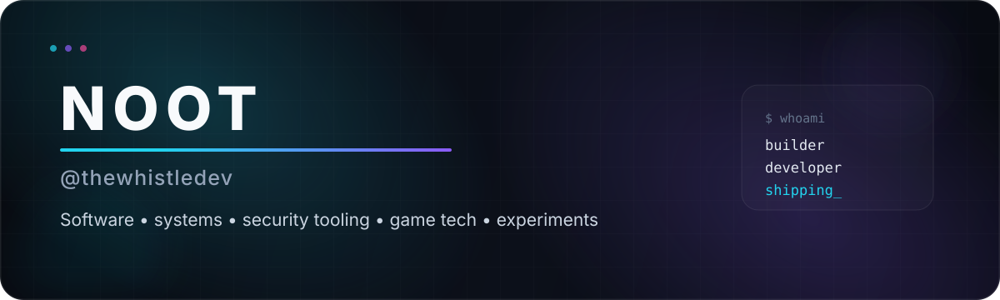
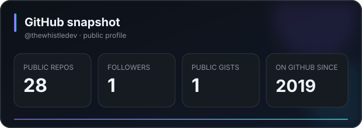
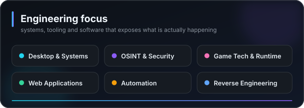

<p align="center">
  
</p>

<p align="center">
  <a href="https://github.com/thewhistledev?tab=repositories"></a>
  <a href="https://github.com/thewhistledev?tab=followers"></a>
</p>

## Hey, I'm Noot.

I build software because apparently leaving computers alone was never an option.

My projects tend to live where **developer tooling, systems, security research, game tech, automation and unusual experiments** overlap. I like turning technical ideas into usable tools rather than leaving them as half-finished proof-of-concepts gathering digital dust.

```text
focus      → useful software, unusual systems, technical tooling
approach   → build it, test it, simplify it, then make it nicer
interests  → desktop apps • OSINT • reverse engineering • web • games • automation
status     → probably working on another project
```

---

## Featured work

<table>
<tr>
<td width="50%" valign="top">

### 🔎 [Domain Dossier](https://github.com/thewhistledev/domain-intelligence-tool)

A registration-free **OSINT domain intelligence platform** that combines DNS, registration data, certificate history, infrastructure, security posture, company signals, related domains and investigation pivots into one evidence-oriented interface.

`Next.js` `React` `TypeScript` `Tailwind` `OSINT`

</td>
<td width="50%" valign="top">

### 🧬 [KokSpy](https://github.com/thewhistledev/KokSpy)

A Windows-first **PE disassembler and static executable-analysis application** with x86/x64 decoding, imports, exports, strings, xrefs, hex analysis, annotations and portable analysis workspaces.

`Go` `Win32` `PE` `x86/x64` `Static Analysis`

</td>
</tr>
<tr>
<td width="50%" valign="top">

### 🎯 [Stand Intercept Script](https://github.com/thewhistledev/StandInterceptScript)

A Stand Lua script for GTA V that estimates real player movement and uses **relative-motion closest-approach prediction** to detect likely intercept courses with configurable filtering and diagnostics.

`Lua` `Stand API` `Game Tooling` `Motion Prediction`

</td>
<td width="50%" valign="top">

### 🧪 [More experiments](https://github.com/thewhistledev?tab=repositories)

My GitHub is less a carefully manicured museum and more an engineering workshop. Expect web projects, utilities, game-related tools, infrastructure experiments and the occasional idea that became a repository before common sense could intervene.

`Software` `Games` `Web` `Tools` `Experiments`

</td>
</tr>
</table>

---

## Toolbox

### Languages

<p>
  
</p>

### Web, runtime & tooling

<p>
  
</p>

### Things I enjoy building

- **Desktop and systems tools** that expose useful technical information without making the UI actively hostile.
- **Security and OSINT utilities** that distinguish evidence from assumptions instead of pretending every correlation is divine revelation.
- **Game tooling and runtime experiments**, especially systems that involve simulation, automation or unusual technical constraints.
- **Web applications and developer infrastructure** with an emphasis on practical architecture over fashionable complexity.

---

## GitHub snapshot

<table>
<tr>
<td width="50%" valign="top">
  
</td>
<td width="50%" valign="top">
  
</td>
</tr>
</table>

<sub>Snapshot values are intentionally repo-hosted rather than dependent on a third-party stats renderer. Current public profile totals were refreshed in August 2026.</sub>

---

## How I think about projects

> **Make the complicated part powerful. Make the user-facing part obvious.**

I prefer software that explains what it is doing, exposes useful diagnostics, fails clearly, and can grow without requiring a ritual sacrifice every time a feature is added.

If a project is technically interesting, slightly unconventional, or solves a problem nobody bothered to package properly, it will probably get my attention.

<p align="center">
  <sub>Built, broken, rebuilt, and occasionally documented by <a href="https://github.com/thewhistledev">@thewhistledev</a>.</sub>
</p>